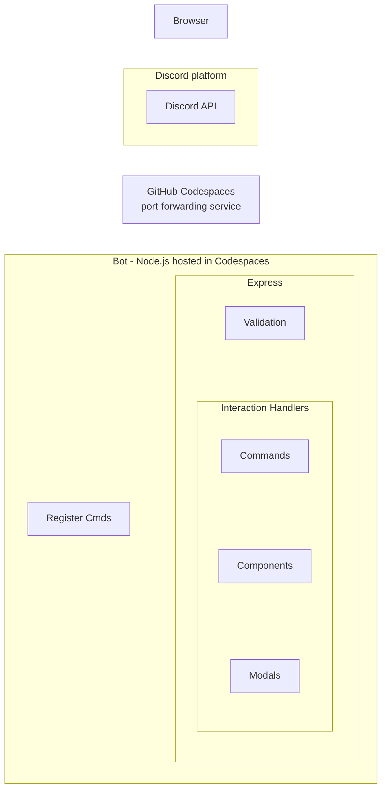
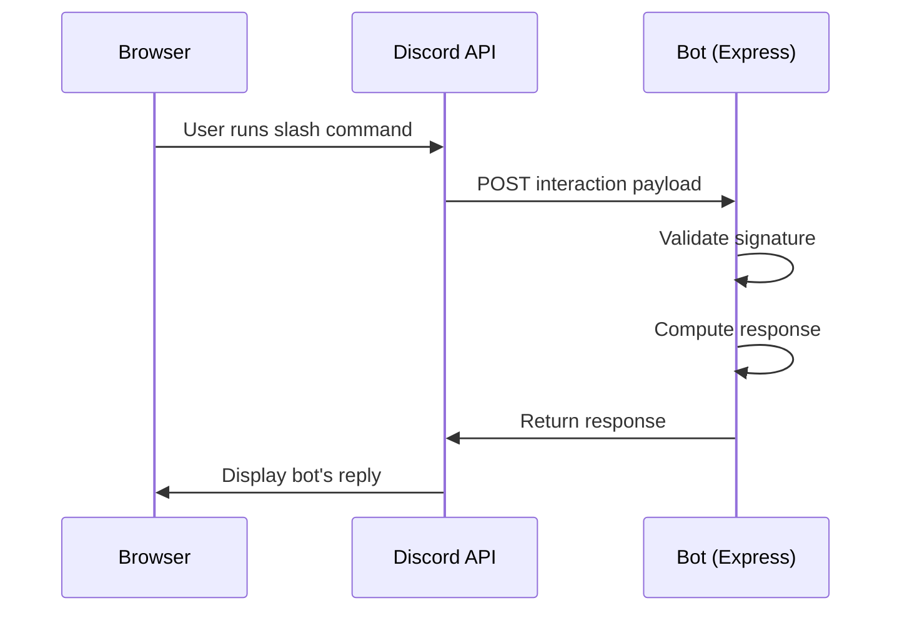

# Architecture 
This is a simple overview of how a Discord Bot works.  

## Block Diagram

Here's an explanation of the diagram:

This diagram shows how a Discord bot is built and where each piece runs, reading roughly top to bottom, to trace how a user's action turns into the bot's response. It starts with the *Browser*, representing a user interacting with Discord through their web client. That connects to the *Discord platform*, specifically the *Discord API*, which is Discord's own infrastructure that receives user actions (like typing a slash command) and needs to notify the bot about them. Since the bot doesn't have a permanent public address of its own, the request passes through the *GitHub Codespaces port-forwarding service*, which acts like a bridge, taking incoming traffic from the internet and routing it into the developer's Codespaces environment where the bot's code is actually running.  

Inside that environment is the *Bot* box, which contains everything the Node.js application does. *Register Cmds* is a one-time or occasional setup step where the bot tells Discord which slash commands it supports, separate from the ongoing request-handling flow. The bulk of the work happens inside `Express`, the web server framework, which first performs *Validation* using the `discord-interactions` package to confirm that incoming requests genuinely came from Discord and haven't been tampered with. Once validated, the request moves into the *Interaction Handlers*, a group of three specialized handlers: *Commands*, *Components*, and *Modals*. Each handler is responsible for a different type of Discord interaction (slash commands, button/menu clicks, and form submissions respectively). The handlers dispatch the work to code that contains the actual logic that decides how the bot should respond.  

## Sequence Diagram

Here is a simple visual of a request/response cycle.  

This sequence diagram provides architectural insight in a different way. Instead of providing a modular/component perspective layed out as boxes, it instead focuses on the system level communications. It illustrates what, when and where messages get passed. There are three **participants**: the `Browser`, which represents the person using Discord; the `Discord API`, which is Discord's own platform/backend; and the `Bot`, which is your `Express` server running in `Codespaces`.  

Reading from top to bottom, the diagram traces a single request through time. First, the Browser sends a slash command, which goes to the Discord API. Discord then forwards that interaction as an HTTP POST request to your Bot. The Bot performs an internal step, validating the signature on the incoming request using the discord-interactions package, to make sure the payload really came from Discord and not from an impersonator. Once validated, the Bot determines the response, and it sends that response back to the Discord API, which finally relays that response to the Browser so the user can see it. The solid arrows represent each message being sent, and the vertical order in which they appear tells you the sequence of events, which is the main thing a sequence diagram is meant to communicate: not the structure of the system, but the timeline of a specific interaction.

Here's the part that trips people up: your HTTP response isn't just "success/fail" and it certainly isn't the full HTML with JavaScript to implement the interactions on the user's browser. Instead, it's a structured JSON object made up of a **response type** and **data**. The user never sees this JSON directly. The JSON is effectively a set of instructions telling Discord's client *what to display and how*. Discord reads that object and does all the rendering on the user's screen.
