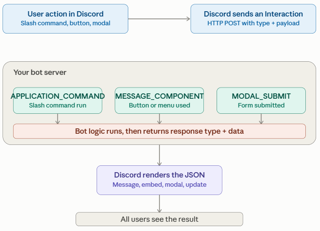

# Task #2: Exploring Example code

## Overview
You should have a very simple Discord bot working. Now you will explore the code found the in `commands` and `module-architecture` folders.  

The goals are:  
* Understand Discord bot coding a bit better  
   - What are HTTP requests and responses  
   - What is an Express Server and how is it used in our implementation   
   - What is JSON and how does that play a role  
* Move to a feature-based, modular organization with co-located command logic to make the bot more extensible  
* Explain and correlate design terms to specific code  

The bot has been be refactored from a monolithic interaction handler into a modular, feature-based architecture. With the changes, each slash command will encapsulate (or co-locate) its command definition, command handler, component handlers, modal handlers, and command-specific state or business logic in a dedicated module (file). Central dispatchers route incoming Discord interactions to the appropriate command module.

This separation of concerns makes commands easier to understand, test, and extend independently. It also reduces coupling and minimizes merge conflicts when multiple developers work on different commands concurrently.

Useful terms for this design include:

- **Feature-based organization** — files are organized by command/feature rather than technical layer.
- **Vertical slice architecture** — each command contains the layers needed for that feature.
- **Co-location** — related definition, behavior, state, and interaction handling live together.
- **Modular architecture** — each command is a relatively independent module.
- **Centralized dispatching** — shared handlers route interactions to command modules.
- **Separation of concerns** — `app.js` handles HTTP/Discord routing while command modules handle feature behavior.
- **Reduced coupling** — commands depend less on unrelated parts of the application.
- **Improved cohesion** — closely related code is kept together.

## Running Modular Architecture
It is easy to switch from the original implementation found in the `orig` folder to the `modular-architecture` folder. You simply need to edit `package.json` by replacing `orig` with `modular-architecture`.

```json
  "scripts": {
    "start": "node modular-architecture/app.js",
    "register": "node modular-architecture/register-commands.js",
    "dev": "nodemon modular-architecture/app.js"
  },
```
This will use the files in the `modular-architecture` directory to register commands and run the Express server.

## Modular File Structure
The following table describes files for the Modular Architecture.  

| File | Description |
| --- | --- |
|**commands**| *Directory* |
| → challenge.js|Implements the `/challenge` command that is a Rock-Paper-Scissors game|
| → test-button.js|Implements `/test-btn` command|
| → test-modal.js|Implements `/test-modal` command|
| → test-select.js|Implements `/test-select` command|
| → test.js|Implements `/test` command|
|**modular-architecture**| *Directory* |
| → app.js | An Express web server that dispatches a specific type of request to the right handler |
| → command-handler.js | Dispatches commands to the right handler |
| → commands.js | Creates the commands array for registration |
| → component-handler.js | Dispatches component requests to the right handler |
| → modal-handler.js | Dispatches modal requests to the right handler |
| → register-commands.js | Registers all the commands as provided by commands.js |
| → utils.js | Provides shared helper functions for Discord API requests, emoji selection, and string capitalization. |

## Overview of Coding a Discord Bot
Discord bots work on a fairly clean request/response model.

### The Big Picture

A Discord bot isn't really a program that "runs inside Discord." It's a separate web server that Discord talks to over HTTP, the same way any website's backend talks to a browser. Discord is the client sending requests; your bot is the server sending back responses. The bot's whole job is: **receive an interaction, figure out what it means, respond correctly.**

### Step 1: Something happens in Discord (the Interaction)

A user does something interactive — types a slash command, clicks a button, picks from a dropdown, or submits a form (a "modal"). Discord packages that event as an **Interaction** and sends it as an HTTP POST request to your bot's server. That's where your `InteractionType` values come in:

- `APPLICATION_COMMAND` — someone ran a slash command (like `/roll dice`)
- `MESSAGE_COMPONENT` — someone clicked a button or used a select menu attached to a message
- `MODAL_SUBMIT` — someone filled out and submitted a popup form

Each of these arrives with a payload describing exactly what happened: which command, which button, what the user typed, who they are, which server/channel, etc.

### Step 2: Your bot decides what to do

This is the actual "coding" part. Your server reads the interaction type and any relevant IDs (like a `custom_id` on a button) and runs whatever logic you wrote — roll a die, look something up in a database, start a game, whatever.

### Step 3: Your bot responds — but the response *is* the UI

Here's the part that trips people up: your HTTP response isn't just "success/fail." It's a structured JSON object with a **response type** and **data**, and that JSON *is* the next thing users see in Discord. You're not writing a chat message like a person — you're returning a specification that Discord's client renders for you. Common response types include:

- Reply with a message (text, embeds, buttons, etc.)
- Show a modal (popup form)
- Acknowledge silently and update later (useful for slow operations)
- Update the existing message (e.g., after a button click)

Discord takes that JSON, renders it according to its own UI rules, and every user in the channel sees the result — a message, buttons, an embed, whatever you specified.

Here is a simple visual of that request/response cycle.  


### A couple of things worth emphasizing

**The bot is stateless per request, mostly**  
Each interaction is its own HTTP request. There's no persistent "conversation" the way a chat feels — every button click or command is a fresh POST with everything the bot needs to know packed into the payload (who clicked, what they clicked, in what channel).

**Timing matters**  
Discord expects a response within 3 seconds, or it shows "This interaction failed." If the bot needs to do something slow (call an API, query a database), it first sends an "I got it, working on it" acknowledgment, then follows up with the real content once it's ready. This is an example of *acknowledge now, respond later*.

**`custom_id` is how buttons/menus "remember" context**  
Since HTTP requests don't carry memory, developers embed identifying info directly into a button's `custom_id` (e.g. `"delete_task_42"`) so that when it's clicked, the bot can parse that string back out and know exactly what to do. There is no database lookup required for simple cases.

