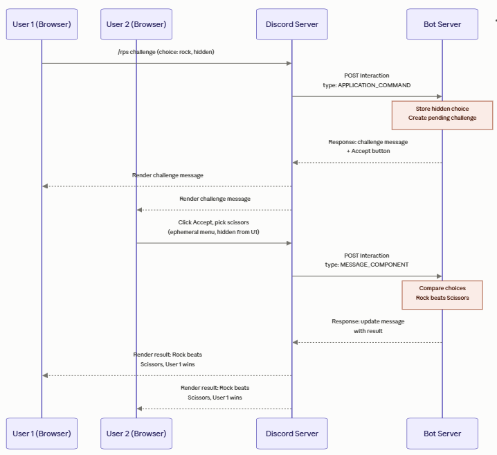
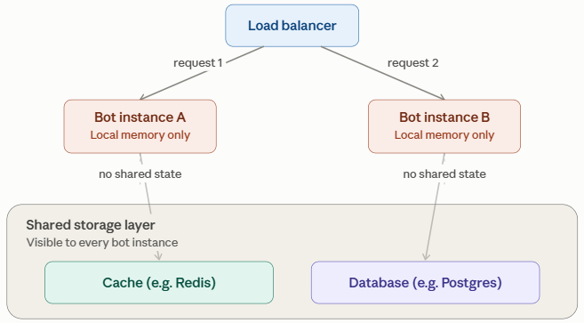

# Task #2: Exploring Example code

## Overview
You should have a very simple Discord bot working. Now you will explore the code found the in `commands` and `module-architecture` folders.  

**Task:** 
* Analyze the architecture and design of your Discord bot.  

**Deliverables:**  
* Two snapshots of the Work Items tracking work in the Kanban board.  
* A set of **hand-drawn** diagrams of the architecture. Take a picture of the paper with the diagram. It must be hand-drawn on paper. Each person submits one of the of the following:  
   - [Data flow diagram (DFD)](https://en.wikipedia.org/wiki/Data-flow_diagram)  
   - [Activity diagram](https://en.wikipedia.org/wiki/Activity_diagram)  
   - [Sequence diagram](https://en.wikipedia.org/wiki/Sequence_diagram) 
   - [System context diagram](https://en.wikipedia.org/wiki/System_context_diagram)   
   - [Network diagram](https://en.wikipedia.org/wiki/Computer_network_diagram) 


**The goals are:**  
* Understand Discord bot coding a bit better  
   - What are HTTP requests and responses  
   - What is an Express Server and how is it used in our implementation   
   - What is JSON and how does that play a role  
* Adopt a feature-based, modular organization with co-located command logic to make the bot more extensible  
* Explain design terms and point to specific code that correlates  

The bot has been be refactored from a monolithic interaction handler into a modular, feature-based architecture. With the changes, each slash command will encapsulate (or co-locate) its command definition, command handler, component handlers, modal handlers, and command-specific state or business logic in a dedicated module (file). Central dispatchers route incoming Discord interactions to the appropriate command module.

This separation of concerns makes commands easier to understand, test, and extend independently. It also reduces coupling and minimizes merge conflicts when multiple developers work on different commands concurrently.

Useful terms for this design include:

- **Feature-based organization** — files are organized by command/feature rather than technical layer.
- **Vertical slice architecture** — each command contains the layers needed for that feature.
- **Co-location** — related definition, behavior, state, and interaction handling live together.
- **Modular architecture** — each command is a relatively independent module.
- **Centralized dispatching** — shared handlers route interactions to command modules.
- **Separation of concerns** — `app.js` handles HTTP/Discord routing while command modules handle feature behavior.
- **Reduced coupling** — commands depend less on unrelated parts of the application.
- **Improved cohesion** — closely related code is kept together.

## Running Modular Architecture
It is easy to switch from the original implementation found in the `orig` folder to the `modular-architecture` folder. You simply need to edit `package.json` by replacing `orig` with `modular-architecture`.

```json
  "scripts": {
    "start": "node modular-architecture/app.js",
    "register": "node modular-architecture/register-commands.js",
    "dev": "nodemon modular-architecture/app.js"
  },
```
This will use the files in the `modular-architecture` directory to register commands and run the Express server.

## Modular File Structure
The following table describes files for the Modular Architecture.  

| File | Description |
| --- | --- |
|**commands**| *Directory* |
| → challenge.js|Implements the `/challenge` command that is a Rock-Paper-Scissors game|
| → test-button.js|Implements `/test-btn` command|
| → test-modal.js|Implements `/test-modal` command|
| → test-select.js|Implements `/test-select` command|
| → test.js|Implements `/test` command|
|**modular-architecture**| *Directory* |
| → app.js | An Express web server that dispatches a specific type of request to the right handler |
| → command-handler.js | Dispatches commands to the right handler |
| → commands.js | Creates the commands array for registration |
| → component-handler.js | Dispatches component requests to the right handler |
| → modal-handler.js | Dispatches modal requests to the right handler |
| → register-commands.js | Registers all the commands as provided by commands.js |
| → utils.js | Provides shared helper functions for Discord API requests, emoji selection, and string capitalization. |

## Overview of Coding a Discord Bot
Discord bots work on a fairly clean request/response model.

### The Big Picture

A Discord bot isn't really a program that "runs inside Discord." It's a separate web server that Discord talks to over HTTP, the same way any website's backend talks to a browser. Discord is the client sending requests; your bot is the server sending back responses. The bot's whole job is: **receive an interaction, figure out what it means, respond correctly.**

### Step 1: Something happens in Discord (the Interaction)

A user does something interactive such as typing in a slash command, clicking a button, picking from a dropdown, or submiting a form (a "modal"). Discord packages that event as an **Interaction** and sends it as an HTTP POST request to your bot's server. That's where your `InteractionType` values come in:

**Interaction Types:**  
- `APPLICATION_COMMAND` — someone ran a slash command (like `/roll dice`)
- `MESSAGE_COMPONENT` — someone clicked a button or used a select menu attached to a message
- `MODAL_SUBMIT` — someone filled out and submitted a popup form

Each of these arrives with a payload describing exactly what happened: which command, which button, what the user typed, who they are, which server/channel, etc.

### Step 2: Your bot decides what to do

This is the actual "coding" part. Your server reads the interaction type and any relevant IDs (like a `custom_id` on a button) and runs whatever logic you wrote — roll a die, look something up in a database, start a game, whatever.

## Step 3: Your bot responds — with instructions for what to display

Here's the part that trips people up: your HTTP response isn't just "success/fail." It's a structured JSON object made up of a **response type** and **data**. The user never sees this JSON directly. The JSON is effectively a set of instructions telling Discord's client *what to display and how*. Discord reads that object and renders the actual message, embed, or form on the user's screen.

You're not writing a chat message the way a person would. You're describing, in a format Discord understands, what the outcome should look like. Discord's client is the one that turns your description into pixels and actions. Common response types include:

- Reply with a message (text, embeds, buttons, etc.)
- Show a modal (popup form)
- Acknowledge silently and update later (useful for slow operations)
- Update the existing message (e.g., after a button click)

Once Discord receives that object, it renders it according to its own UI rules, and every user in the channel sees the resulting message, buttons, or embed<sup>[1]</sup> — never the underlying JSON itself.

Here is a simple visual of that request/response cycle.  


### A couple of things worth emphasizing

**The bot is stateless per request, mostly**  
Each interaction is its own HTTP request. There's no persistent "conversation" the way a chat feels — every button click or command is a fresh POST with everything the bot needs to know packed into the payload (who clicked, what they clicked, in what channel).

**Timing matters**  
Discord expects a response within 3 seconds, or it shows "This interaction failed." If the bot needs to do something slow (call slow API, query a distant database, generate a report), it first sends an "I got it, working on it" acknowledgment, then follows up with the real content once it's ready. This is an example of *acknowledge now, respond later*.

**`custom_id` is how buttons/menus "remember" context**  
Since HTTP requests don't carry memory, developers embed identifying info directly into a button's `custom_id` (e.g. `"delete_task_42"`) so that when it's clicked, the bot can parse that string back out and know exactly what to do. There is no database lookup required for simple cases.

## Rock-Paper-Scissors Sequence
To help explain 


There are a few things worth explaining:

**How does User #2's choice stay hidden from User #1?** This is the trickiest part of the game design. When User #2 clicks "Accept," the bot doesn't just reveal a text box — it typically responds with an **ephemeral**<sup>[2]</sup> message (a response only the clicking user can see) containing buttons or a dropdown for rock/paper/scissors. This is a meaningful Discord feature worth noting: response data can include a flag that makes a message private to just one user, which is exactly how you'd keep a "secret choice" secret in a public channel.

**Why two separate interactions?** Notice the diagram has two full round trips — one for the initial slash command, one for the accept/choice. Each is its own independent HTTP request/response cycle. The bot has to persist the game state (who challenged, their hidden choice) somewhere between those two requests, since nothing carries over automatically. Servers can store temporary state (in memory, a database, or a cache) between interactions.<sup>[3]</sup>

**The final update goes to *both* browsers from one bot response.** The bot doesn't send two separate messages. The bot sends one updated message object back to Discord Server, and Discord Server broadcasts that render to everyone viewing the channel, including both users. 

## JSON
JSON (JavaScript Object Notation) is a text format for exchanging structured data. It may be stored in a `.json` file or sent in an HTTP request or response. Despite its name, JSON is language-independent.

JSON supports six value types: **object**, **array**, **string**, **number**, **Boolean** (`true` or `false`), and **null**.

- Objects use braces and contain comma-separated name/value pairs: `{ "name": "Ada" }`.
- Arrays use brackets and contain comma-separated values: `["rock", "paper", "scissors"]`.
- Object names and string values require double quotes.
- JSON does not support comments, trailing commas, `undefined`, functions, or JavaScript template literals.

For example, Discord can receive this JSON response and display its `content` as a message:

```json
{
  "type": 4,
  "data": {
    "content": "Hello from the bot!"
  }
}
```

The bot code usually creates the response as a **JavaScript object literal**, such as `commands/test.js` does, and Express serializes it as JSON when `res.send(...)` sends the HTTP response. JavaScript object literals resemble JSON but allow features JSON does not, including unquoted property names, single-quoted strings, constants, expressions, and shorthand properties. For example, if a variable named `content` exists, `{ content }` is shorthand for `{ content: content }`.

Reference: [MDN: Working with JSON](https://developer.mozilla.org/en-US/docs/Learn_web_development/Core/Scripting/JSON)


# Footnotes
[1] An **embed** is a richer, more structured message format in Discord — the kind you've probably seen without knowing the name: a box with a colored left border, maybe a title, a description, separate labeled fields, a thumbnail image, a footer, sometimes a big image at the bottom. Bot status messages, music "now playing" cards, and error notices with red borders are almost always embeds.

Structurally, it's just another piece of data in that JSON response object — instead of (or alongside) plain text, you include an `embeds` array with fields like:

```json
{
  "title": "Task Created",
  "description": "Your task has been added to the board.",
  "color": 3066993,
  "fields": [
    { "name": "Assigned to", "value": "@alice", "inline": true },
    { "name": "Due date", "value": "Aug 15", "inline": true }
  ],
  "footer": { "text": "Task Bot" }
}
```

Discord takes that structured data and lays it out visually as a formatted card. It's the same underlying idea as the response type/data pattern you already have in your notes — embeds are just one specific *shape* of data your bot can send, useful whenever you want something more organized-looking than a plain sentence of text.

It is interesting to note that "data describing what to display" can range from a single line of text all the way up to a fairly complex visual layout, and Discord handles all the rendering either way.

[2] **Ephemeral Message**:  
An ephemeral message is a normal interaction response with one extra piece of data attached: a message **flag**. Instead of posting to the channel for everyone, it's rendered only in the view of the user who triggered the interaction, everyone else in the channel never sees it, and it doesn't persist in the channel's message history the way a regular message does.

Technically, it works exactly like the response object we've been discussing; it has the same `type` and `data` structure except the `data` includes a `flags` field with the value 64 (the EPHEMERAL flag, expressed as 1 << 6). Discord's client reads that flag and decides to render the message privately instead of publicly.

A few practical notes:

- It's not encryption or a security boundary. An ephemeral flag is a *rendering instruction*. The bot server and Discord both technically have the data; it's just not displayed to other channel members.  
- Ephemeral responses are commonly used for exactly the kind of thing in the Rock-Paper-Scissors example: letting one user privately pick an option (or see an error message) without leaking it to everyone else in the channel.  
- If a bot defers its response first, that deferral can also be marked ephemeral. So even a "thinking…" placeholder can stay private if you want the whole interaction hidden from the start.  

References:  
[Receiving and Responding to Interactions](https://docs.discord.com/developers/interactions/receiving-and-responding)   
Official Discord Developer documentation covering interaction response types and the EPHEMERAL message flag.

[Command response methods](https://discordjs.guide/slash-commands/response-methods)  
This Discord.js Guid shows how to send an ephemeral reply in code, with a before/after example of what users see.  

[MessageFlags enum reference](https://discord-api-types.dev/api/discord-api-types-v10/enum/MessageFlags)  
Full list of message flags, including Ephemeral and others like Loading and IsComponentsV2.

[3] **Remembering stuff on a Server**  

When we said the bot needs to "remember" something between interactions (like a pending Rock-Paper-Scissors challenge), we glossed over an important question:  

> Remember it *where*?   

The answer depends heavily on how the bot server is deployed, not just on the data itself.  

Here is the takeaway worth stating explicitly:  
> The "right" storage choice isn't a fact about the data — it's a fact about the deployment.  

 The exact same "remember this pending game" requirement has a different correct answer depending on whether you're running a single bot process on your laptop (in-memory is fine) or a production bot scaled across multiple instances behind a load balancer (in-memory silently breaks, and you need shared storage). Here we present a good real-world example of how architecture constraints shape what would otherwise be a simple coding decision.  

1. *In-memory (a variable or object in your running program)*:  
The simplest option — fast, no setup, easy to reason about for a class project. But it only works if there's exactly one instance of your bot process running, and that process doesn't restart. Real-world bots are often deployed with multiple instances behind a load balancer for reliability and scale — and that breaks in-memory storage immediately, because the request that creates the challenge might land on Instance A, while the "accept" click later gets routed to Instance B, which has no idea the challenge exists.

2. *Database (e.g. Postgres, MongoDB)*:  
Durable and shared across every instance. Good for data that needs to survive a server restart or matters long-term (user stats, leaderboards, settings). The tradeoff is speed — a database round trip is slower than reading a local variable, and you're now managing schemas, connections, and persistence logic.

3. *Cache (e.g. [Redis](https://en.wikipedia.org/wiki/Redis))*:  
A middle ground: shared across instances like a database, but built for short-lived, fast-access data. Great fit for something like a pending game challenge where data only needs to live for a few minutes and doesn't need to survive forever. Many production Discord bots use Redis for exactly this kind of temporary interaction state.

Here is a sketch of an architecture where there is load balancer across multiple server instances providing services for a single Discord Bot. These details change everything:  


# Q & A
1. Explain how the network architecture is identical while the code's design can be radically changed from it's original mess (in `orig`) to the modular design (in `modular-architecture`).  

2. Point to the code where we can see a module.  

3. Explain the flow of execution for handling the `/test` command. What methods are invoked? In the explanation, use the terms: dispatch, module, request, response, JSON.  

4. Explain how a lot of the bot code is the creation of JSON objects. Point out a place in the code where an object is created.  

5. Explain the relationship between Node, Express Server, and npm.  

6. 
