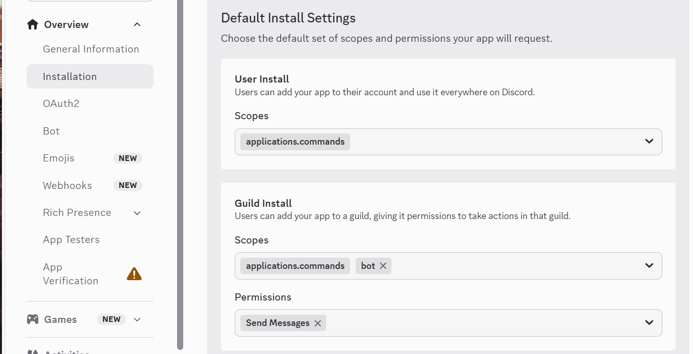
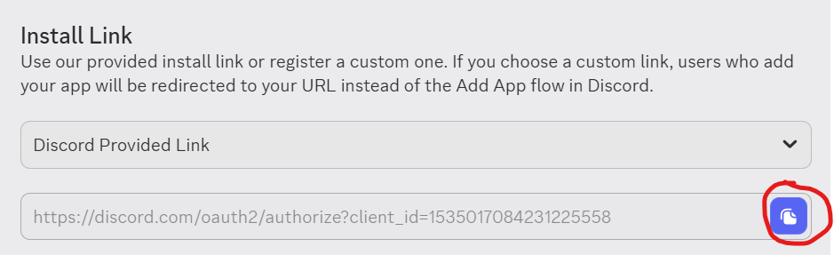
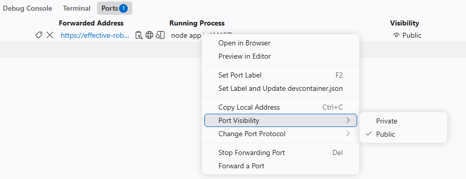
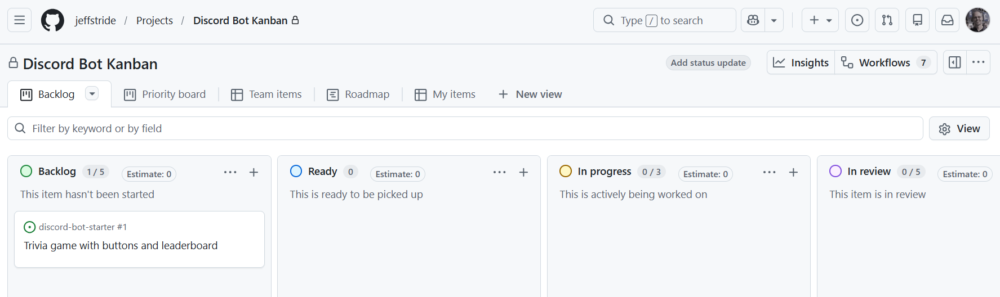

# Task #1: Creating a Discord Bot 
You will create a Discord Bot in JavaScript.  

## Overview
You will be creating a Discord Bot! Have fun!

**Task:**  
* Create a Discord Bot hosted in Codespaces using the template code provided in GitHub Classrooms.

**Deliverables:**  
* Submit a screenshot of your browser that has a completed `/challenge` command.  
* Submit a screenshot of the Kanban board with a work item in the backlog.  
* In class, you'll fill out a survey as you and a peer review your understanding of your work in this task.  

## Introduction 
This README describes the project and provides a set of instructions for creating a simple Discord bot.
You will complete **Task #1** as a group. Individuals are responsible for understanding every part of the technology,
and every student will be required to work on their own in future tasks.
There is a **Q&A section** with questions that each student needs to be able to answer.

The instructions below will create a minimal Discord bot built with Discord's **HTTP Interactions** model developed in 
**GitHub Codespaces**. This mirrors [Discord's official quick-start guide](https://docs.discord.com/developers/quick-start/getting-started),
but swaps their local-machine + `ngrok` setup with Codespaces.  

> **IMPORTANT**: The template code contains two separate implementations for a Discord bot. For this task, you'll be using the code in the directory `orig`.  

The code provides a `/challenge` command that is a basic rock-paper-scissors-style Discord app written in JavaScript. The code was taken from the [getting started guide](https://discord.com/developers/docs/getting-started).  

### The mental model

- **Discord's servers** are where a person types slash commands such as `/test` in a channel.
- Discord doesn't run your code for you. Instead, it sends an **HTTP request** to the `bot` using a URL you provide and waits for your code to respond.
   - This may be different from bots you may have seen elsewhere that stay constantly connected over a websocket (the "gateway" model). We are using a stateless request/response model, like a tiny website.  
   - This means your bot only works **while your server is running** and its URL is reachable via a `public` port. If you stop the app or close the Codespace, `/test` will fail until you start the bot again.
- **discord-interactions** (the `npm package` this project uses) handles the security handshake for you: verifying that a request really came from Discord, and answering Discord's periodic "are you alive?" (`PING`) check.

### Project structure
Below is a basic overview of the project structure:

```
├── .vscode
|   └──  launch.json  -> Lets you press F5 in VS Code to run the bot with the debugger attached
|
├── commands                -> Folder with commands for the modular design
|   └── <see README-task2>
|
├── modular-architecture    -> Folder with a modular design for a bot
|   └── <see README-task2>
|
├── orig            -> original implementation of the bot server
|   ├── app.js      -> The Express server that implements Discord bot commands
|   ├── commands.js -> Defines what slash commands exist 
|   ├── game.js     -> helper functions for the Rock-Paper-Scissors game 
|   └── register-commands.js     -> registers commands found in commands.js
|
├── .env.sample 
├── .gitignore 
├── package.json -> the manifest file for a Node.js project      
├── README.md
└── utils.js    -> utility functions 
```


## Task #1 Steps
This will help you setup your environment with sample code.  

### 0. Create Discord Server
1. Create a Discord account by going to [Discord](https://discord.com).  
   - If you already have an account, you can go to:  https://discord.com/channels/@me  
2. Create your own server by clicking the `+` button in the left navigation and selecting "Add a server". Make it for your friends only.

### 2. Create `.env` on Codespaces  
We need to open the repo on Codespaces...  
1. On the GitHub site, open your Git repo. If needed, select `<> Code` in the navigation bar.
2. In the body of the page, select `<> Code` and select the `Codespaces` tab.
3. Select the `+` to create a Codespace on `main`.  

> **VS Code client**: It should be possible interact with the Codespaces instance through the VS Code local client, but the setup is more involved. For those interested in trying...  
> *  In VS Code, install the **GitHub Codespaces** extension if you don't have it.  
> * Command Palette (`Cmd/Ctrl+Shift+P`) → **Codespaces: Create New Codespace** → pick this repo/branch. VS Code will connect to it like a remote window.  

Now create the `.env` file... 
1. At the top-level (same level as .env.sample), create the file `.env`.  
2. Copy the contents of `.env.sample` into `.env`  
   - Note: If you are working in VS Code client and have the extension `Dotenv Official + Vault` installed and functioning, then your *secrets* will be "redacted" with black boxes. To disable it, take note of the small grey text at the top: *"Toggle auto-cloaking"*.  

> **Important**: The `.env` file is added to the `.gitignore` file and will **not** be added to the Git repo. It is important to NOT add this file to the repo because it contains *secrets*.

### 3. Create a Discord Application
1. Go to the [Discord Developer Portal](https://discord.com/developers/applications) → **New Application**, give it a name.
2. On **General Information**, copy the values for **Application ID** and **Public Key** and add them to `.env` using the same variable names shown in [.env.sample](.env.sample): `DISCORD_APPLICATION_ID` and `PUBLIC_KEY`.
3. Go to **Bot** (left sidebar) → **Reset Token** → copy it to `.env` as `DISCORD_TOKEN`; Discord won't show it to you again.
4. Go to **Installation** (left sidebar):
   - Under **Installation Contexts**, leave both **User Install** and **Guild Install** checked.
   - Under **Default Install Settings**:
      - add scope `applications.commands` for both
      - add scope `bot` for Guild Install. When `bot` appears, also check the **Send Messages** permission.
      - This actually adds a bot user to the server's member list, giving your code a presence that can send messages, react, join voice channels, etc. The scopes `applications.commands` and `bot` are the bare minimum for a Guild Install.  

  

5. **Install the bot**:  
   - Copy the **Install Link** shown on the Installation page.  
   - Paste it into your browser, hit enter, and choose **Add to Server** to install the bot to your personal test server.  

  

### 4.  Register your slash commands
Before you can do much of anything, you need to have all the Node modules installed. 

Open a Terminal window and type in:
```bash
npm install
```
Now you should have a directory named `node_modules` and you can register your slash commands with Discord. You only need to do this once. Type in:
```bash
npm run register
```
The `npm install` should be required only when creating the Codespace instance this first time. Stopping and restarting the same Codespace won't require you to repeat the command.

The entire container is persisted, so if you enter the same codespace again, all your files will be there, including the `node_modules` folder. The node_modules folder contains all the modules needed to run your project and will persist even though the files are not checked into the repo. It's just a folder on the remote disk. You can stop and restart a Codespace without losing the changes that you make to your project. So as long as you're reopening the same Codespace (via "Resume codespace" or from github.com/codespaces), your installed packages will still be there.

The `npm run register` command should result in something similar to the following output: 
```
Registered 4 command(s): test, test-btn, test-modal, challenge
Global commands can take up to an hour to show up the first time.
```

### 5. Run the bot
```bash
npm start
```
The above command should output: `Listening on port 3000`.

> Note: In the VS Code client, you should be able to press **F5** to run the bot with the debugger attached. Breakpoints will work!  

### 6. Make the port reachable and copy the URL
1. Open the **Ports** tab at the bottom of VS Code. Port `3000` should already be listed. It will likely be set to `private`. 
2. Right-click → **Port Visibility → Public**  

  

If the menu option is not available, it is likely because there are policies or restrictions on your environment that prevent it. In that case, may need to use a public tunnel such as **ngrok** or **Cloudflare Tunnel**. 

A private port will not work because Discord needs access to the bot. 

The URL should look something like:
```
https://your-codespace-name-3000.app.github.dev
```

3. **Test the URL** by pasting it into the browser (or you can Ctrl+click the URL in the Ports window). You should get a response that looks like:
```
Discord bot is running. Use /interactions for Discord callbacks.
```

### 7. Tell Discord where to send interactions
1. Go back to the [Discord Developer Portal](https://discord.com/developers/applications), and go to **General Information**  
2. Paste your URL **followed by `/interactions`** into the **Interactions Endpoint URL** field:
```
https://your-codespace-name-3000.app.github.dev/interactions
```

3. Click **Save Changes**. Discord immediately sends a test `PING` to verify a response. If the server is running the save should work. If it fails, confirm the app is running and the port is public, then try saving again.  

### 8. Test it
You may need to refresh your Discord site, or just wait a bit. Make sure that you have the Codespaces bot running (listening on port 3000).   

In your Discord test server, type `/test`. The bot should reply "hello world 👋". (The emoji will be random.)   

### 9. GitHub Settings
If you created the Git project via GitHub Classroom, and you added team members from there, then the permissions should be good-to-go. However, if for whatever reason, this is not the case, then you need to make sure that the professor and all team members have Write access to the repo.  

### 10. Project Kanban Board
1. Go to GitHub and find `Projects` in the navigation bar. 
2. Create a new project, and use the `Kanban` template. 
3. Create a new placeholder feature in the Backlog of your Kanban board.  

  

## Troubleshooting  
ISSUE: **The `npm run register` command fails**  
> * Be sure to read the specific failure message for clues!   
> * Verify that `.env` has all the values set correctly. If you regenerated a token in the Developer portal, you'll need to use the new token. 
> Did you run `npm install`?  
> Does `package.json` have the correct path to the 'register-commands.js' file?  

ISSUE: **I can't start the server due to: Error: listen EADDRINUSE: address already in use :::3000**  
> This can happen sometimes when your AI agent started the server previously and it is still running. You can manually kill the server with two separate commands. The first is to list processes and find the process ID (PID). The second is to kill the process with that PID.  
```
lsof -i :3000
kill -9 <PID>
```


ISSUE: **The interactions Endpoint URL won't save**  
> The can be caused when the app isn't running, or the port isn't public. Check both.  

ISSUE: **Command doesn't show up in Discord**   
> * Sometimes it takes a while for the command to become available.  
> * Sometimes you need to refresh the Discord page in your browser.  
> * You may need to re-register your commands with: `npm run register`.  

ISSUE: **The bot didn't respond in time to the slash command**  
> * Most likely the server isn't running. Verify that your Codespace instance is running.  
> * Verify that your bot server is using a `public` port.  
> * Verify that your port is reachable in the browser.  
> * Perhaps you didn't add the bot to the Discord server.  


## Next steps for learning more
- Add more commands by using the Examples provided in the examples folder.  
- [Interactions Overview docs](https://docs.discord.com/developers/interactions/overview) explain the security model in more depth.
- [discord-interactions-js on GitHub](https://github.com/discord/discord-interactions-js) has more usage examples.


## Applying Changes
If you changed bot behavior, stop the running process and start it again.  
> In the Terminal, type in `Ctrl+C` to stop the server, then `npm start` to start it again. 

> Note: if you want auto-restarts during development, you can use an altnerative way to start the server: `npm run dev`  

If you changed the set of slash commands you want: run `npm run register` again so Discord updates the command list.
   - Code changes: a restart is required (stop with Ctrl+C, then start with `npm start`)
   - Slash command changes require re-registering
The bot will not magically pick up new code until the server restarts, and Discord command updates can take a little time to appear.

# Q & A
**1. What is Codespaces? How does it relate to a git repository?**

Codespaces is a full development environment that runs in the cloud instead of on your own laptop. 

It is a virtual machine with VS Code, a terminal, and all your project files, accessible through a browser (or the VS Code client). Every Codespace is created *from* a specific repository (and even a specific branch of it). GitHub clones your repo onto that cloud machine automatically when the Codespace is created. So the repo is the actual source of truth for your code (tracked by git, with full history), and a Codespace is just a disposable, ready-to-use *place to run and edit* that code without installing Node, git, or anything else locally.  

Codespaces has a local copy of all the files. You can add files or change files in Codespaces without making any changes to the Git repository. Users should commit and push desired changes to `git` so that the work can be tracked and persist. Commiting to git will allow you to delete a Codespace and recreate it anytime without losing anything... as long as your changes were committed and pushed to the repo.

**2. What is the difference between a Discord Test Server, a Discord App, and a Discord bot?**
A Discord App is registered with Discord and contains a Bot that is installed into one or more Servers.

These are three different things that are easy to conflate:
- A **Discord Server** (called a "guild" internally) is just a community space — channels, members, roles. A *test* server is simply one you create for development, separate from any real community, so you're not spamming real users while debugging. There's no special *"Test Server"* type in Discord. Any server you create uses the exact same features, settings, and permissions system regardless of what you name it or what you use it for. "Test server" is purely a *label*, not a Discord feature.  
- A **Discord App** (a.k.a. "Discord Application") is what you register in the [Developer Portal](https://discord.com/developers/applications). It's the overall project record. It holds your Application ID, Public Key, install settings, and the bot's token. Think of it as the "account" for your project on Discord's side.  
- A **Discord Bot** is the specific piece of a Discord App that gets a **user-like presence *inside* a server**. A Discord bot appears in the member list, can be @mentioned, and can send/receive messages. It's created *from* your Discord App and then installed *into* a server (your test server, in this case).


**3. What is a Terminal?**

A terminal is a text-based window where you type commands directly to the computer's operating system, instead of clicking buttons in a graphical app. Commands like `npm install` or `git checkout` are typed here. In Codespaces, the terminal you're using is actually running on the remote cloud machine, not your own computer, so the commands you type (like installing packages) affect the Codespace's filesystem, not your laptop.

**4. What is a Port?**

A port is a numbered "door" on a computer that a specific running program listens on for network traffic. 

The word *port* is overloaded and is also used to mean the physical opening on a computer where a cable can be plugged into. In our code, we do not mean that kind of port. 

A single machine can run many programs at once, each listening on its own port number, so incoming requests know which program to go to. When your bot's server runs `npm start` and prints "Listening on port 3000," it means your Express server has claimed port 3000 and is waiting for HTTP requests to arrive there. Discord needs a *public* URL pointing at that port so it can actually reach your server from the outside internet — that's why you had to make port 3000 public and copy its forwarded URL into the Interactions Endpoint URL field.

**5. What is `npm`? What files in the project are related to it?**  

`npm` (Node Package Manager) is the tool that installs and manages external code libraries ("packages") that your project depends on, and lets you define shortcut commands to run your project. Two files tie into it:
- **`package.json`**: the project's manifest. Lists your dependencies, project metadata, and the custom `scripts` (like `start` and `register`) that `npm run` executes.
- **`package-lock.json`**: automatically generated and updated whenever dependencies change. It pins the *exact* versions of every package (including sub-dependencies) so that everyone on the team, and every Codespace, installs identical versions. This is a great way to avoid "it works on my machine" bugs.

You'll also see a **`node_modules`** folder appear after `npm install`. This is where the actual downloaded package code lives. It's not a file tied to npm's configuration, but it's the *result* of npm doing its job; it's excluded from git via `.gitignore` since it can be regenerated anytime from `package.json`.

**6. What is an Express server?**  

`Express` is a lightweight web framework for `Node.js` that makes it easy to build servers that handle HTTP requests.

The Express server will receive HTTP requests, decide what to do based on the URL/method, and send back an HTTP response.

Without a framework, handling raw HTTP requests in Node is verbose and repetitive (manually parsing URLs, methods, headers, etc.). Express wraps that in a simple, readable API. In your bot project, this is the code can be found in `app.js`. 

**7. How do you start and stop the bot server?**  

Start with `npm start` and stop with `Ctrl+C`.

- **Start:** run `npm start` in the terminal. This runs whatever command is defined under `"start"` in `package.json` (in this project, it launches `app.js`, which is an Express server), and you should see `Listening on port 3000`.
- **Stop:** with the terminal focused, press `Ctrl+C`. This sends an interrupt signal that ends the running process. You'll get your terminal prompt back once it's stopped.

You need to stop and restart the server any time you change code in `app.js` or `utils.js` because the server doesn't automatically reload; it just keeps running whatever code was loaded when it started. However, if you use `npm run dev` to start the server instead, it auto-restarts for you whenever you save code. This can be handy (but perhaps overkill) while actively coding.

**8. What is a "bot server"?**  

It is a process listening on a network port for incoming requests.

A bot server is the actual running program that listens on a port and waits for Discord to send it interaction requests. The server code then figures out how to respond and sends that response back. It's called a "server" in the precise technical sense: a process listening on a network port for incoming requests.

A bot server is different from the "bot" itself, which refers to the Discord-facing identity (the member entry in your test server). The bot server is the code powering that identity behind the scenes. If the bot server isn't running (or its port isn't public), the bot will still *appear* online-looking in the member list depending on settings, but it won't actually respond to any slash commands, because nothing is there to answer Discord's requests.

**9. What is the file `.gitignore`?**  
It is a `git` file that contains information about what file **NOT** to sync to the remote repository in the cloud. It is important to NOT sync `.env` and all the modules in the `node_modules` directory installed by Node.js.  